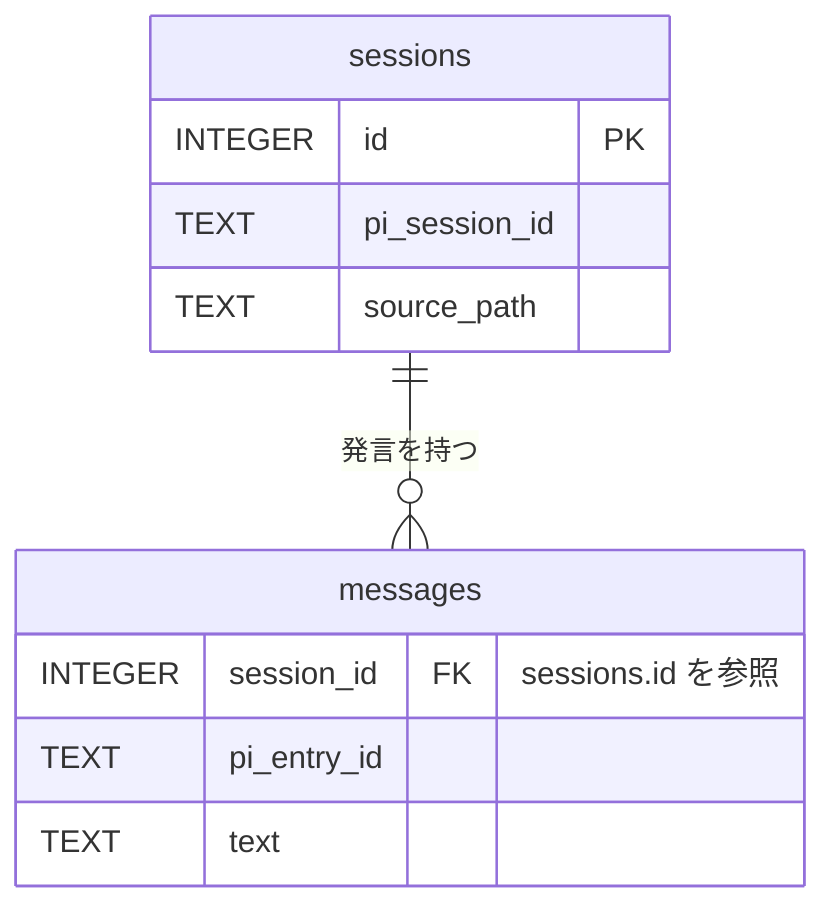

1. import サブコマンド
- Pi v3のjsonlを読み込む。
- 末尾のレコードからparentIdをたどり、ブランチを復元
- sqliteにsessionsとmessagesのテーブルを追加する。

```mermaid
erDiagram
    sessions ||--o{ messages : "発言を持つ"

    sessions {
        INTEGER id PK
        TEXT pi_session_id
        TEXT source_path
    }

    messages {
        INTEGER session_id FK "sessions.id を参照"
        TEXT pi_entry_id
        TEXT text
    }
```

2. search サブコマンド
- 部分一致探索
